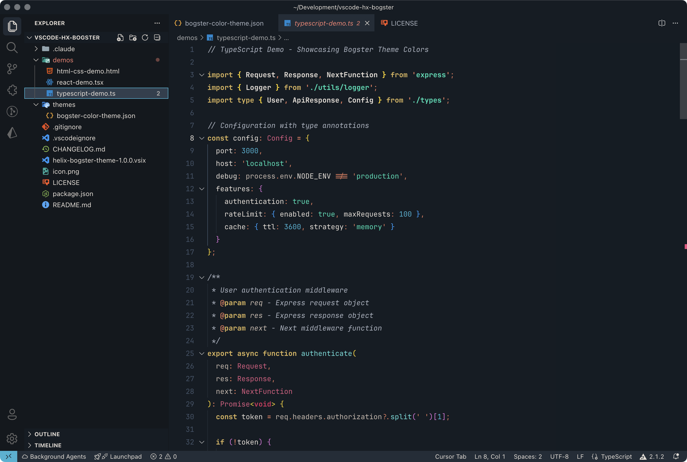
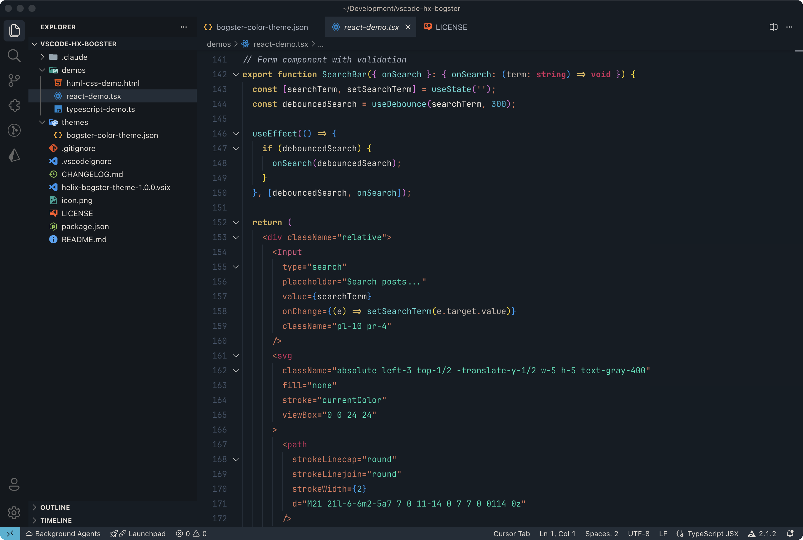
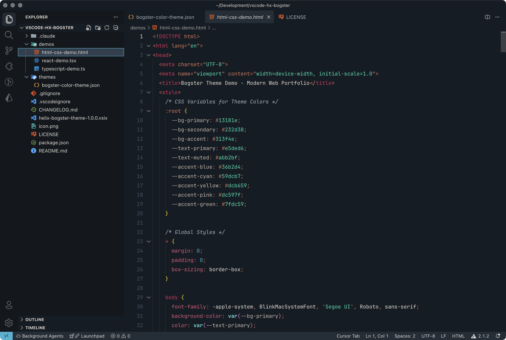
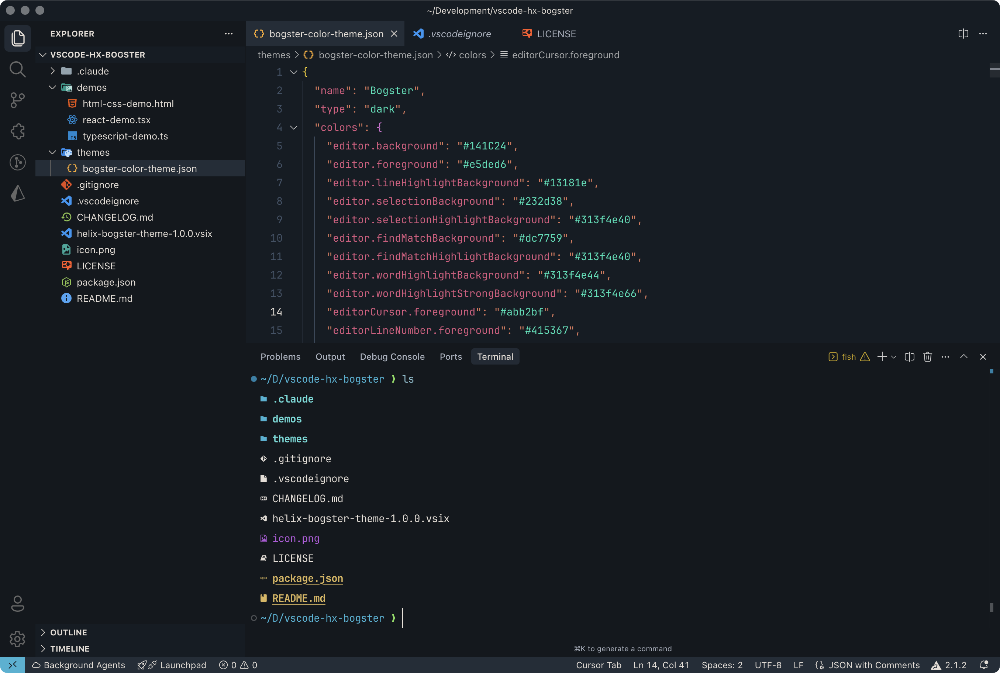
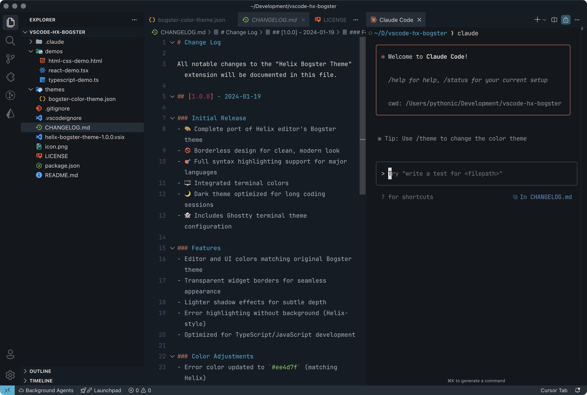

# 🎨 Helix Bogster Theme for VS Code

[](https://marketplace.visualstudio.com/items?itemName=boosted.helix-bogster-theme)
[](https://marketplace.visualstudio.com/items?itemName=boosted.helix-bogster-theme)
[](https://opensource.org/licenses/MIT)

A meticulously crafted dark theme for Visual Studio Code, inspired by the popular Bogster theme from the Helix editor. Experience a modern, borderless design that's easy on the eyes during those long coding sessions.



## ✨ Features

- 🚫 **Borderless Design** - Clean, distraction-free interface
- 🎯 **Helix-Inspired** - Faithful port maintaining the original aesthetic
- 🌈 **Complete Syntax Support** - Optimized for all major languages
- 🖥️ **Integrated Terminal** - Matching terminal colors for consistency
- 👁️ **Eye-Friendly** - Carefully balanced contrast and color choices
- 🔧 **TypeScript/React Optimized** - Special attention to modern web development

## 📸 Screenshots

### TypeScript


### React / JSX


### HTML / CSS


### Terminal


### AI Assistant Integration


## 🚀 Installation

### Via VS Code Marketplace
1. Open **Extensions** sidebar panel in VS Code: `View → Extensions`
2. Search for **"Helix Bogster"**
3. Click **Install**
4. Click **Reload** to activate the theme
5. Go to `Code → Preferences → Color Theme → Bogster`

### Via Command Line
```bash
code --install-extension boosted.helix-bogster-theme
```

### Manual Installation
1. Download the `.vsix` file from [Releases](https://github.com/your-username/vscode-hx-bogster/releases)
2. Run: `code --install-extension helix-bogster-theme-*.vsix`

## 🎨 Color Palette

| Syntax | Color | Hex | Sample |
|--------|-------|-----|---------|
| Background | Dark Blue-Gray | `#13181e` |  |
| Foreground | Light Cream | `#e5ded6` |  |
| Comments | Muted Cyan | `#59dcb7` |  |
| Keywords | Golden Yellow | `#dcb659` |  |
| Strings | Aqua Green | `#59dcb7` |  |
| Functions | Sky Blue | `#59dcd8` |  |
| Types | Soft Pink | `#dc597f` |  |
| Errors | Bright Pink | `#ee4d7f` |  |

## 🛠️ Customization

If you want to customize any colors, add this to your `settings.json`:

```json
"workbench.colorCustomizations": {
    "[Bogster]": {
        "editor.background": "#161c23",
        "editor.foreground": "#e5ded6"
    }
}
```

For token color customization:
```json
"editor.tokenColorCustomizations": {
    "[Bogster]": {
        "comments": "#59dcb7"
    }
}
```

## 🖥️ Terminal Theme

This extension includes a matching Ghostty terminal theme! Check out `ghostty-bogster-theme` for installation instructions.

### Quick Install for Ghostty:
```bash
cat ghostty-bogster-theme >> ~/.config/ghostty/config
```

## 🤝 Contributing

Found a bug or have a suggestion? Feel free to:
- [Open an issue](https://github.com/your-username/vscode-hx-bogster/issues)
- Submit a pull request
- Share your screenshots!

## 📝 License

MIT License - see [LICENSE](LICENSE) file for details.

## 🙏 Credits

- Original [Bogster theme](https://github.com/helix-editor/helix/blob/master/runtime/themes/bogster.toml) by [Wojciech Kępka (@wojciechkepka)](https://github.com/wojciechkepka)
- Inspired by the [Helix editor](https://helix-editor.com/)
- Built with ❤️ for the VS Code community

---

**Enjoy coding with Bogster!** 🚀

If you like this theme, please consider:
- ⭐ Starring the [GitHub repository](https://github.com/your-username/vscode-hx-bogster)
- 📝 Leaving a [review on the Marketplace](https://marketplace.visualstudio.com/items?itemName=boosted.helix-bogster-theme)
- 🐛 Reporting any issues you find